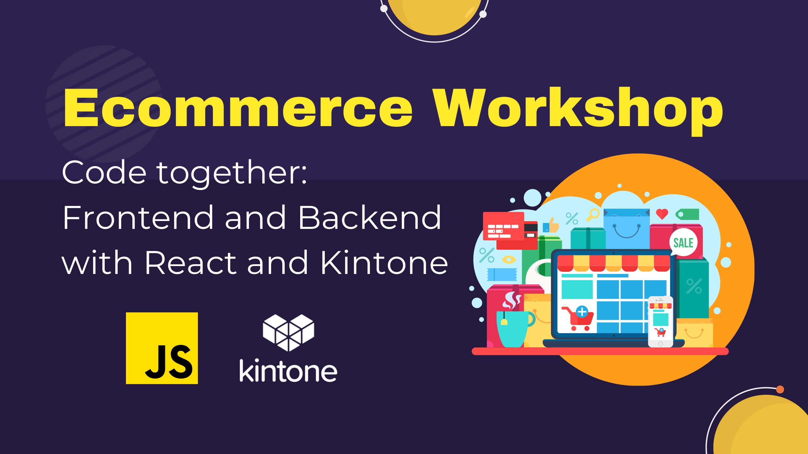
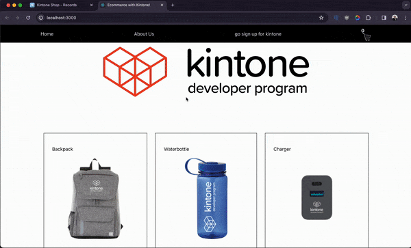

# Code Together: Ecommerce Frontend and Backend with Kintone

---



Join us for an **live** code-along where we create an ecommerce frontend and backend in two hours using React and Kintone!
Reserve your spot now and let's **Code Together!**

## Outline <!-- omit in toc -->
* [Completed Project](#completed-project)
* [Get Started](#get-started)
* [Get Your Free Kintone Database](#get-your-free-kintone-database)
* [Workshop Steps](#workshop-steps)
* [Debugging](#debugging)
* [Completed Code](#completed-code)
* [Overview of the Repo](#overview-of-the-repo)

## Completed Project


## Get Started
_Clone the Repo & Install Dependencies_ 💪

First, clone the [kintone-workshops/ecommerce-kintone](https://github.com/kintone-workshops/ecommerce-kintone) repo!  🚀  
Then go inside the folder & install the dependencies!

⚡ Two terminal windows are required for this workshop.

### Terminal 1

```shell
cd Downloads

git clone https://github.com/kintone-workshops/ecommerce-kintone

cd ecommerce-kintone

npm install
```
Open the `ecommerce-kintone` folder in [VS Code](https://code.visualstudio.com/docs/getstarted/tips-and-tricks#_command-line) as well:

```shell
code .
```

### Terminal 2

```shell
cd Downloads/ecommerce-kintone/src

cd backend && npm install
```

## Get Your Free Kintone Database

[kintone.dev/new/](http://kintone.dev/new/)
* ⚡ Only use lowercase, numbers, & hyphens in your subdomain
* ⚠ Do not use uppercase or special characters

|                                                                                                               |                                                                                                                                 |
| ------------------------------------------------------------------------------------------------------------- | ------------------------------------------------------------------------------------------------------------------------------- |
|          |  |
|  |                                                               |

For more information, check out the [Workshop_Steps.md > B. Get Your Free Kintone Database](./docs/Workshop_Steps.md#b-get-your-free-kintone-database) section!

---

## Workshop Steps

[Workshop_Steps.md](./docs/Workshop_Steps.md)

---

## Debugging
**Let's Fix Those Problems** 💪

Here is a rundown of common problems that may occur & their solutions!

See [Snippets_Debug.md](./Snippets_Debug.md)

---

## Completed Code
If you want the completed code, you can find it here:  
[Solution](./docs/Solution.md)

---

## Overview of the Repo

<details>
  <summary> ↯ Overview of the Repo ↯ </summary>

| File                                               | Purpose                                                                   | Need to Modify?        |
| -------------------------------------------------- | ------------------------------------------------------------------------- | ---------------------- |
| [package.json](package.json)                       | Project's metadata & scripts for building and uploading the customization |                        |
| [.env.example](.env.example)                       | The template for the .env file                                            |                        |
| [.env](.env)                                       | Holds the Kintone login credential and View ID                            | Yes! - Create it       |
| [src/App.js](src/App.js)                           | The default for React projects. It will handle our front end.             | Yes! Complete the code |
| [src/style.css](src/style.css)                     | Styling for the project can go here                                       |                        |
| [src/backend/server.js](src/backend/server.js)                     | This will handle our store's logic, like checking and decreasing stock etc.            |   Yep! Lot's of coding today.            |
| [docs/Workshop_Steps.md](./docs/Workshop_Steps.md) | Step-by-step guide that we do during the workshop                         |                        |

</details>
