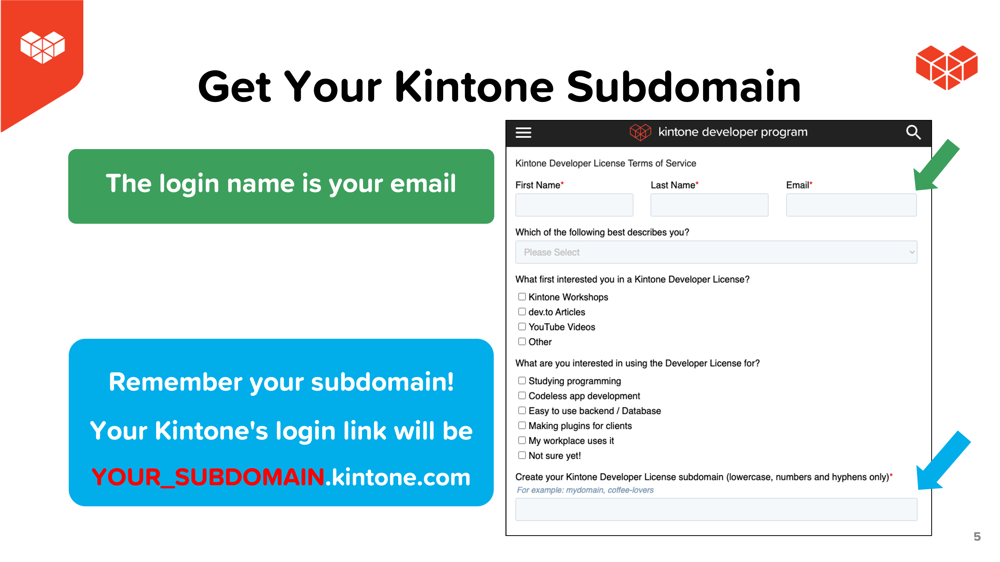

# Workshop Steps
This guide outlines all the steps required to complete the workshop.

## Outline <!-- omit in toc -->
* [A. Get started - clone the repo \& install dependencies](#a-get-started---clone-the-repo--install-dependencies)
* [B. Get your free Kintone database](#b-get-your-free-kintone-database)
* [C. Create a `.env` file](#c-create-a-env-file)
* [D. Create a Kintone web database app](#d-create-a-kintone-web-database-app)
   * [Fields](#fields)
   * [Steps to create the Kintone App](#steps-to-create-the-kintone-app)
* [E. Generate an API token for the Kintone app](#e-generate-an-api-token-for-the-kintone-app)
* [F. Add a record to the Kintone App](#f-add-a-record-to-the-kintone-app)
* [G. Let's Code!](#g-lets-code)
   * [Coding the frontend in App.js](#coding-the-frontend-in-appjs)
   * [Coding the backend in server.js](#coding-the-backend-in-srcbackendserverjs)
* [H. Start the Servers](#h-start-the-servers)
* [Check your work](#check-your-work)
* [Still got a problem?](#still-got-a-problem)

## A. Get started - clone the repo & install dependencies

First, clone the [kintone-workshops/ecommerce-kintone](https://github.com/kintone-workshops/ecommerce-kintone) repo!  🚀  
Then go inside the folder & install the dependencies!

⚡ Two terminal windows are required for this workshop.

### Terminal 1

```shell
cd Downloads

git clone https://github.com/kintone-workshops/ecommerce-kintone

cd ecommerce-kintone

npm install
```

### Terminal 2

```shell
cd Downloads/ecommerce-kintone

cd backend && npm install
```

## B. Get your free Kintone database

1. Go to [kintone.dev/new/](http://kintone.dev/new/) and fill out the form.  
   * ⚡ Only use lowercase, numbers, & hyphens in your subdomain
   * ⚠ Do not use uppercase or special characters
   * 🤖 Example subdomain: `example`
   * ✅ Use Chrome or Firefox
   * ❌ Do not use Safari
2. Look for "**Welcome to Kintone! One More Step for Developer License**" email in your inbox and click the **Activate Now** button.
   * Sent from `developer@kintone.com`
   * If you don't see it, check your spam folder
3. Set the **Initial Password**
4. Log into your Kintone Subdomain
   * URL: {your subdomain}.kintone.com (e.g. `example.kintone.com`)
   * Login Name: Your email address
   * Password: The password you set in Step 3
   * ⚡ If you forget your password, you can reset it by clicking the **Having Trouble Logging In?** link on the login screen.

|                                                                                                            |                                                                                                                              |
| ---------------------------------------------------------------------------------------------------------- | ---------------------------------------------------------------------------------------------------------------------------- |
|          |  |
|  |                                                               |

## C. Create a `.env` file

Duplicate the [.env.example](./../.env.example) file and save as `.env` file.  
This is where we will be saving the login credentials and API Keys.

Here is what your `.env` might look like:

```txt
SUBDOMAIN = "example"
APPID = "1"
APITOKEN = "1J22qNAR54I4eiMcd0JmfDAavJNfNJDVaqt34X9A"
```

### ⚠️ WARNING ⚠️ <!-- omit in toc -->

⚠️ DO NOT DELETE THE [.env.example](./../.env.example) FILE!  
[.env.example](./../.env.example) is used by env-cmd to verify that the `.env` file is correctly configured.

## D. Create a Kintone web database app

Let's create an **Ecommerce** Kintone App!  

Here are the required fields & their configurations for our workshop:

### Fields

| Field Type | Field Name | Field Code | Note                                                                                                                            |
| ---------- | ---------- | ---------- | ------------------------------------------------------------------------------------------------------------------------------- |
| Text       | **Name**   | `name`     |                                                                                                                                 |
| Number     | **Count**  | `count`    | In the count field, you can set the minimum acceptable value to 0. This will make API calls to reduce stock past 0 fail for us. |
| Number     | **Price**  | `price`    | The price field won't be used in this version, but a good challenge after the workshop is to introduce pricing.                 |

### Steps to create the Kintone App

To create the Kintone App, click the **➕** button on the upper right side of the Kintone Portal.


Once you have configured the fields, the Kintone App should look like this:  


Then, click the **Save Form** and **Activate App** buttons! 💪

_Confused? 🤔 → Check out the [How to Create a Kintone Database App](https://youtu.be/pRtfn-8cf_I) video 📺_

## E. Generate an API token for the Kintone app

We need to generate an API Token for our Kintone App.

1. From the Kintone App, click the **App Settings** button ⚙️ on the upper right side.
  
1. Select the **App Settings** tab
1. Under **Customization and Integration**, click the **API Token** button.
1. Click **Generate**. 
1. Check the `Add records` and `Edit records` box.  
  
1. Copy the API Token and paste it to the `APITOKEN` variable in your `.env` file.
1. Click the **Save** button on the bottom right side of the screen.
1. Click the **Update App** button on the upper right side of the screen.

Next, let's fill in the `APPID` and `SUBDOMAIN` in our `.env` file.
The number can be easily found in the Kintone App's URL!

Go to the Kintone App and grab the URL.  
* Example: `https://devevents.kintone.com/k/52/`

Kintone App's URL follows this template:  
* `https://<SUBDOMAIN>.kintone.com/k/<App ID>/show#record=<RECORD ID>`

So then the `https://devevents.kintone.com/k/52/` URL tells us that this App's ID is `52`


---

## F. Add a record to the Kintone App

1. Go to your Kintone App and add a record by clicking the **➕** button on the upper right side of the screen.
2. Fill out the fields. For this workshop, we're selling Waterbottles, Chargers, and Backpacks. 
   - Add `Backpack` as your first record,
   - `Watterbottle` as your second record, and
   - `Charger` as your third record.


⚠️ The **Record Number** has to be the same as the **id**, and the **Name** has to be the same as the **productName** in [productsList](../src/data/products.js)

## G. Let's Code!

### Coding the frontend in App.js

For this workshop, we will be coding in [./src/App.js](../src/App.js) and [./src/backend/server.js](../src/backend/server.js).

Let's start with our frontend in [./src/App.js](../src/App.js).

We have two coding challenges here:

1. Our products aren't displayed! Let's map through them and get some cards on the front page.
2. Our `addToCart()` function needs to be filled in.

Let's check out what our HTML (JSX) is doing, and see if we can display some products.
At the top of [./src/App.js](../src/App.js), you can see we have a few imports:

```js
import { useState, useRef } from 'react';
import './App.css';
import Hero from './components/hero.js';
import Card from './components/card.js';
import Header from './components/header.js';
import productsList from './data/products.js';
import { Oval } from 'react-loader-spinner'
import { Toaster } from 'react-hot-toast';
import Confetti from 'react-confetti'
import tryCheckout from './requests/tryCheckout.js';
```

These are components (ugly ones) I made to speed the workshop along. It is a very basic web design pattern, to have rows of `cards`, and our store is no different.
We're also importing [productsList](../src/data/products.js). Here we have a basic JSON like object array with some images ready.

Scroll down to the `TODO` on line 87 in [./src/App.js](../src/App.js).
We're going to be **mapping** through our products list here, and displaying each one in a `card`.

```jsx
        <div className='row'>
          {productsList.map((product, index) => {

          })
          }
        </div>
```
In React, you'll often be `looping` through data, and displaying each piece of data with it's properties. Most beginners will immediately reach for the `forEach` loop, however in React you'll be using the `map` function, which assigns certain properties of objects to specific places.

We have a [card.js](../src/components/card.js) component ready... let's look at what kind of props it wants:

``` jsx
import '../App.css';
import toast from 'react-hot-toast';

let Card = (props) => {
  return (
    <div className='card' onClick={() => {
      props.addToCart(props.productName)
      toast.success("Added to Cart!")
    }}>
      <p>{props.productName}</p>
      
    </div>
  );
};

export default Card;
```
You can see it has a few props being used:

`props.addToCart(props.productName)`
`props.productName`
`props.img`

Let's give them to our card component:

``` jsx
        <div className='row'>
          {productsList.map((product, index) => {
            return (
              <Card key={index} productName={product.productName} img={product.productImage} addToCart={addToCart} />
            );
          })
          }
        </div>
```
The `productName` and `productImage` props come from our [productsList](../src/data/products.js).
Open the file and take a look!

However, what is the `addToCart` prop?

That is our next `TODO` on line 19 of [./src/App.js](../src/App.js).
When we click on a product, we want to add it to our cart, right?
We have a blank `addToCart(selectedItem)` function to fill in.

If you `console.log(selectedItem)` in the function, you'll see that it is giving us the `productName` property. Let's check each one of our products, and if the name matches, increase its `count` in the cart.

```js
  let addToCart = (selectedItem) => {
    let cartCopy = cart;
    cartCopy.forEach(cartObject => {
      if (cartObject.productName == selectedItem) {
        cartObject.count += 1;
        setCartCount(cartCount + 1);
      }
    });
    setCart(cartCopy);
  }
```

First, we copy the cart as it is.
Then for each object in the cart, if the name matches, we increase its `count` by one. We also increment the cool `cartCount` badge in the header.
Last, we set the cart with our new values via the `setCart(cartCopy)` hook.

### Coding the backend in src/backend/server.js

If we click on our cart button, we have a `checkout` button ready, which fires off the `startCheckout()` function. This function makes a `PUT` request to our Express backend at `localhost:50000/putData`. It displays a loading circle while making the request. If successful, it resets our cart, and we get cool confetti as well. Woohoo.

But what is a successful request? Since we're not handling payment, we'll just be checking if we have enough product in stock. This is the `count` field from our Kintone App.

We have two coding challenges here:

1. First get our current stock from our database.
2. Check the stock against how many items were requested, and update the database with the new stock if there is enough.

Open up [/src/backend/server.js](../src/backend/server.js), and look for the `TODO` on line 31.

We want to get our stock of items from our Kintone Database. If you can fill this out, you're already a pretty competent Kintone Developer!

```js
let checkItemStock = async () => {
  const fetchOptions = {
    method: 'GET',
    headers: {
      'X-Cybozu-API-Token': apiToken
    }
  }
  const response = await fetch(multipleRecordsEndpoint, fetchOptions);
  return response.json();
}
```
The `checkStock()` function is as simple as can be with Kintone.
Make a `fetch` request to the [getRecords](https://kintone.dev/en/docs/kintone/rest-api/records/get-records/) endpoint. Return that data as JSON. Thanks Kintone.

Now that we have our backend stock, let's loop through each item in the cart, check it against the stock, and if we have enough in stock, update the values for our database.

In short, if someone wants `3` backpacks, and we only have `2`, this will error out. If we have enough, say `5` backpacks, then our new count in our backend will be `2`.

Check the next `TODO` on line 42-ish.

``` js
let compareRequestAndStock = async (stock, request) => {
  let validItems = [];
  request.forEach(requestedItem => {

  });
  return validItems;
}
```
Ok start looping. For each item requested, let's find that item in our backend list.

``` js
let compareRequestAndStock = async (stock, request) => {
  let validItems = [];
  request.forEach(requestedItem => {
    let stockItem = stock.find((item) => item.Record_number.value === requestedItem.id.toString())
  });
  return validItems;
}
```
We use the Javascript `find` function, and compare the ID of the item, to the record number.
Now that we know which item we're talking about, let's compare their counts.

``` js
let compareRequestAndStock = async (stock, request) => {
  let validItems = [];
  request.forEach(requestedItem => {
    let stockItem = stock.find((item) => item.Record_number.value === requestedItem.id.toString())
    if (stockItem.count.value >= requestedItem.count) {
      let newItem = requestedItem;
      newItem.count = stockItem.count.value - requestedItem.count;
      validItems.push(newItem)
    }
  });
  return validItems;
}
```
If the count is greater than or equal to the requested amount, create a copy of that item, with a `count` value of the difference. This is what we'll save back into our database.

## H. Start the servers

Open two terminal windows

### Terminal 1 - Frontend

```shell
cd ecommerce-kintone

npm run start
```

### Terminal 2 - Backend

```shell
cd ecommerce-kintone/backend

npm run start
```

Navigate to [`localhost:3000`](http://localhost:3000/) and let's try to checkout!
If you see confetti, you have a working ecommerce project.

Congratulations, you did it!

## Refactoring / Improving

Experienced coders will see a few major sources of trouble / areas to improve on.

1. Our `find()` function above requires that the store objects are registered in the Kintone Database in a certain order. You should really not use `Record_Id`, but add an `id` field for each product.
   
2. But really, we're keeping our products in a JSON file. Shouldn't we be getting all the product data, including the `count` from our Kintone Database in the first place? See if you can add a `/getProducts` route to [./src/backend/server.js](../src/backend/server.js), then `map` (Hint hint) through that information on the frontend. This way, you could even display the price, or remaining stock if you want. You could even block people from adding to their cart if there isn't enough stock.

3. Our frontend doesn't handle failure very well... When there isn't enough stock, the wheel just spins. Using the `response` from our backend's `checkoutTry.success` parameter, maybe add a `toast` or other UI element to let users know their purchase failed.

4. Our frontend code is a little messy... maybe we should turn the popup dialogs into components.

5. And the big one, adding payment. There are many frameworks that help you handle payment. I personally am a big fan of Stripe the company. You'd want to make a payment request in [./src/backend/server.js](../src/backend/server.js) after checking the stock available, wait for the response, and then continue with the checkout flow. Maybe even save the customer shipping data etc in another Kintone App?

## Check your work

Is your code not working?

Compare your [./src/App.js](../src/App.js) and [./src/backend/server.js](../src/backend/server.js) with the [Solution.md](./Solution.md) to see if it is all written correctly.

## Still got a problem?

Post your Kintone customization questions over at our community forum:  
[forum.kintone.dev](https://forum.kintone.dev/)

Watch our [Youtube](https://www.youtube.com/@KintoneDeveloperProgram) or something!
Good luck coding! 💪
