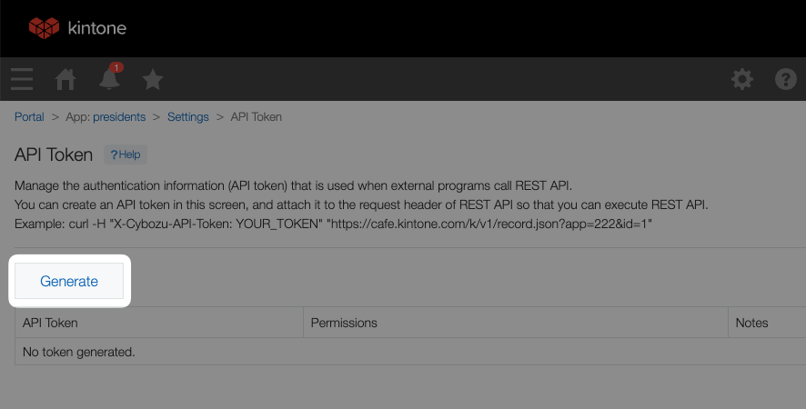
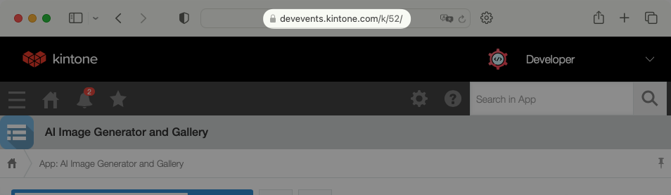

# Workshop Steps
This guide outlines all the steps required to complete the workshop.

## Outline <!-- omit in toc -->
* [A. Get started - clone the repo \& install dependencies](#a-get-started---clone-the-repo--install-dependencies)
* [B. Get your free Kintone database](#b-get-your-free-kintone-database)
* [C. Create a `.env` file](#c-create-a-env-file)
* [D. Create a Kintone web database app](#d-create-a-kintone-web-database-app)
   * [Fields](#fields)
   * [Steps to create the Kintone App](#steps-to-create-the-kintone-app)
* [E. Generate an API token for the Kintone app](#e-generate-an-api-token-for-the-kintone-app)
* [F. Add a record to the Kintone App](#f-add-a-record-to-the-kintone-app)
* [G. Edit App.js](#g-edit-appjs)
* [Check your work](#check-your-work)
* [Still got a problem?](#still-got-a-problem)

## A. Get started - clone the repo & install dependencies

First, clone the [kintone-workshops/ecommerce-kintone](https://github.com/kintone-workshops/ecommerce-kintone) repo!  🚀  
Then go inside the folder & install the dependencies!

```shell
cd Downloads

git clone https://github.com/kintone-workshops/ecommerce-kintone

cd ecommerce-kintone

npm install

cd ./src/backend

npm install
```

## B. Get your free Kintone database

1. Go to [kintone.dev/new/](http://kintone.dev/new/) and fill out the form.  
   * ⚡ Only use lowercase, numbers, & hyphens in your subdomain
   * ⚠ Do not use uppercase or special characters
   * 🤖 Example subdomain: `example`
   * ✅ Use Chrome or Firefox
   * ❌ Do not use Safari
2. Look for "**Welcome to Kintone! One More Step for Developer License**" email in your inbox and click the **Activate Now** button.
   * Sent from `developer@kintone.com`
   * If you don't see it, check your spam folder
3. Set the **Initial Password**
4. Log into your Kintone Subdomain
   * URL: {your subdomain}.kintone.com (e.g. `example.kintone.com`)
   * Login Name: Your email address
   * Password: The password you set in Step 3
   * ⚡ If you forget your password, you can reset it by clicking the **Having Trouble Logging In?** link on the login screen.

|                                                                                                            |                                                                                                                              |
| ---------------------------------------------------------------------------------------------------------- | ---------------------------------------------------------------------------------------------------------------------------- |
|          |  |
|  |                                                               |

## C. Create a `.env` file

Duplicate the [.env.example](./../.env.example) file and save as `.env` file.  
This is where we will be saving the login credentials and API Keys.

Here is what your `.env` might look like:

```txt
SUBDOMAIN = "example"
APPID = "1"
APITOKEN = "1J22qNAR54I4eiMcd0JmfDAavJNfNJDVaqt34X9A"
```

### ⚠️ WARNING ⚠️ <!-- omit in toc -->

⚠️ DO NOT DELETE THE [.env.example](./../.env.example) FILE!  
[.env.example](./../.env.example) is used by env-cmd to verify that the `.env` file is correctly configured.

## D. Create a Kintone web database app

Let's create an **Ecommerce** Kintone App!  

Here are the required fields & their configurations for our workshop:

### Fields

| Field Type | Field Name | Field Code | Note                                                                                                                            |
| ---------- | ---------- | ---------- | ------------------------------------------------------------------------------------------------------------------------------- |
| Text       | **Name**   | `name`     |                                                                                                                                 |
| Number     | **Count**  | `count`    | In the count field, you can set the minimum acceptable value to 0. This will make API calls to reduce stock past 0 fail for us. |
| Number     | **Price**  | `price`    | The price field won't be used in this version, but a good challenge after the workshop is to introduce pricing.                 |

### Steps to create the Kintone App

To create the Kintone App, click the **➕** button on the upper right side of the Kintone Portal.
* 

Once you have configured the fields, the Kintone App should look like this:  


Then, click the **Save** and **Activate App** buttons! 💪

_Confused? 🤔 → Check out the [How to Create a Kintone Database App](https://youtu.be/pRtfn-8cf_I) video 📺_

## E. Generate an API token for the Kintone app

We need to generate an API Token for our Kintone App.

1. From the Kintone App, click the **App Settings** button ⚙️ on the upper right side.
   * 
2. Select the **App Settings** tab
3. Under **Customization and Integration**, click the **API Token** button.
4. Click **Generate**. 
5. Check the `Edit records` box.  
   * 
6. Copy the API Token and paste it to the `APITOKEN` variable in your `.env` file.
7. Click the **Save** button on the bottom right side of the screen.
8. Click the **Update App** button on the upper right side of the screen.

Next, let's fill in the `APPID` and `SUBDOMAIN` in our `.env` file.
The number can be easily found in the Kintone App's URL!

Go to the Kintone App and grab the URL.  
* Example: `https://devevents.kintone.com/k/52/`

Kintone App's URL follows this template:  
* `https://<SUBDOMAIN>.kintone.com/k/<App ID>/show#record=<RECORD ID>`

So then the `https://devevents.kintone.com/k/52/` URL tells us that this App's ID is `52`



---

## F. Add a record to the Kintone App

1. Go to your Kintone App and add a record by clicking the **➕** button on the upper right side of the screen.
2. Fill out the fields (for this workshop, we're selling `Waterbottles`, `Chargers`, and `Backpacks` ) and save the record by clicking the **Save** button on the bottom left side of the screen.


## G. Edit App.js

For this workshop, we will be coding in [./src/App.js](../src/App.js) and [./src/backend/server.js](../src/backend/server.js).

## Check your work

Is your code not working?

Compare your [./src/App.js](../src/App.js) with the [Solution.md](./Solution.md) to see if it is all written correctly.

## Still got a problem?

Post your Kintone customization questions over at our community forum:  
[forum.kintone.dev](https://forum.kintone.dev/)

Watch our [Youtube](https://www.youtube.com/@KintoneDeveloperProgram) or something!
Good luck coding! 💪
